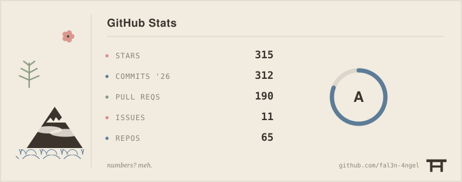

# Adithya Krishnan 
*Developer | Cinephile | Weeb*
  
    💻 Current Focus: Personal developer tools, APIs, and frontend systems.
    🌐 Portfolio: www.adithyakrishnan.com

---

🌱 Worklog

 

- [fal3n-4ngel/SOYO](https://github.com/fal3n-4ngel/SOYO) — SOYO - Stream Own Your Own || Effortlessly stream files from your local system via local network and enjoy your personal collection anywhere in your home. _(today)_

🔥 Picks

 

- [aks-hayy/WatchTower](https://github.com/aks-hayy/WatchTower) _(3 months ago)_
- [trufflesecurity/trufflehog](https://github.com/trufflesecurity/trufflehog) — Find, verify, and analyze leaked credentials _(9 years ago)_
- [coderabbitai/awesome-coderabbit](https://github.com/coderabbitai/awesome-coderabbit) — Official awesome-list of CodeRabbit Starters & Resources ⚡️ _(1 year ago)_
- [pear-devs/pear-desktop](https://github.com/pear-devs/pear-desktop) — Pear 🍐 is extension for music player _(7 years ago)_
- [m4xshen/dotfiles](https://github.com/m4xshen/dotfiles) — My dotfiles for Neovim, Kitty, yabai, SketchyBar _(4 years ago)_

 

